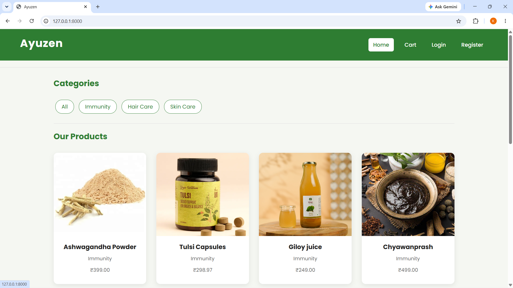
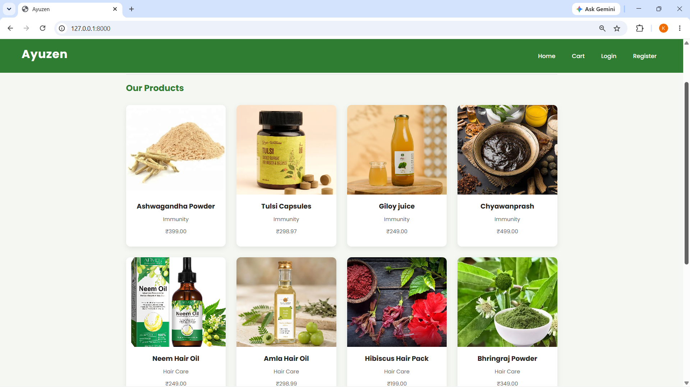
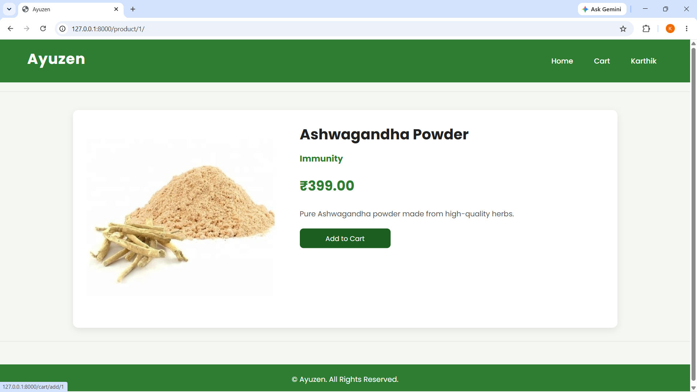
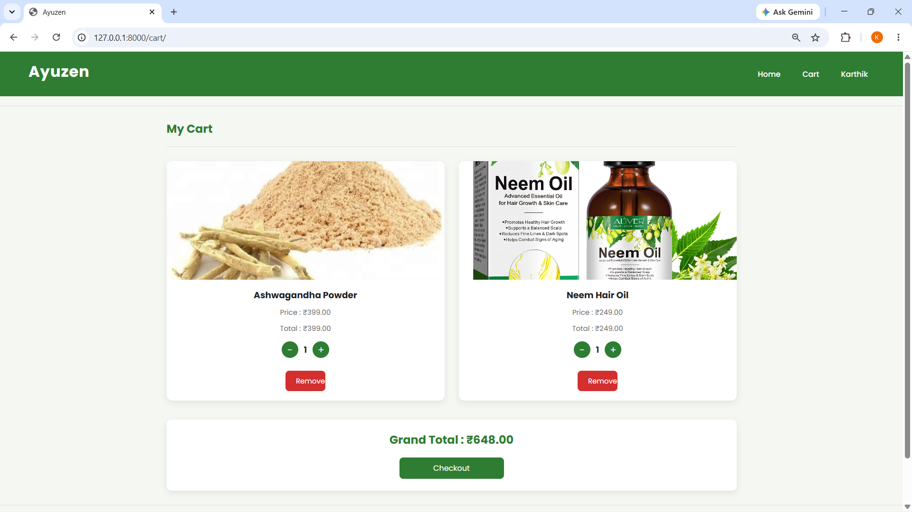
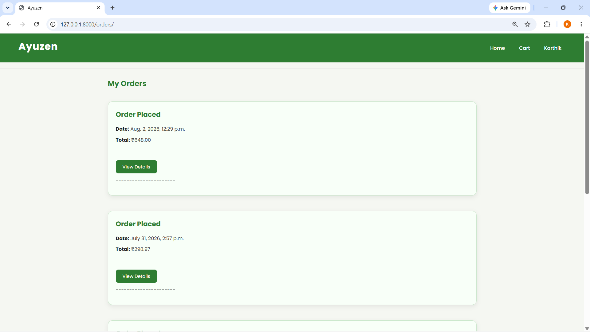
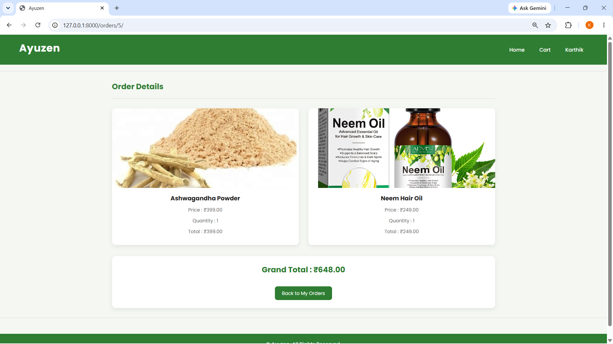
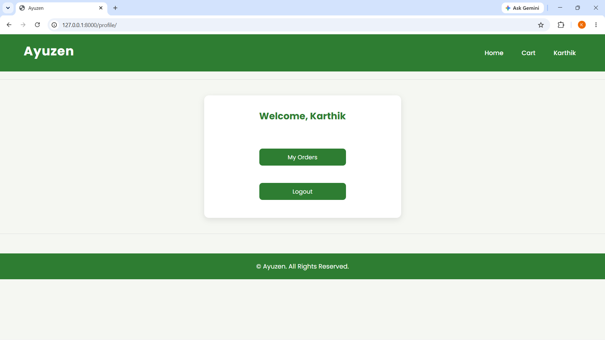
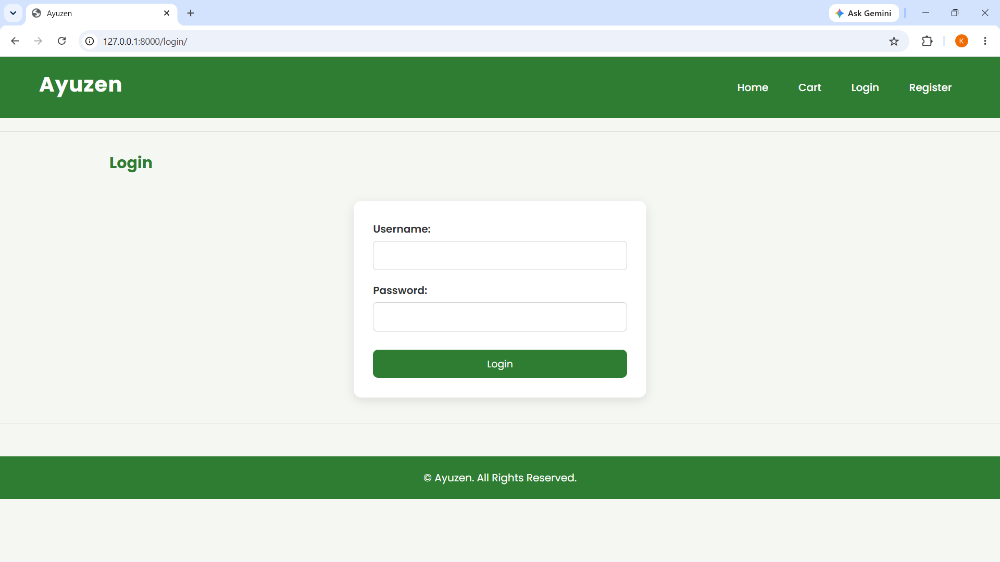
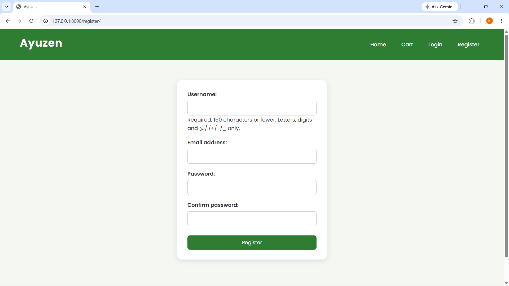

# 🌿 Ayuzen - Ayurveda E-Commerce Website

Ayuzen is a Django-based e-commerce web application that allows users to browse Ayurvedic products, add them to a shopping cart, place orders, and manage their profile.

---

## 📌 Features

- User Registration & Login
- User Profile
- Browse Products
- Product Categories
- Product Details
- Add to Cart
- Increase / Decrease Quantity
- Remove Items from Cart
- Checkout
- Order History
- Order Details
- Responsive User Interface

---

## 🛠️ Tech Stack

- Python
- Django
- HTML
- CSS
- SQLite
- Git
- GitHub

---

## 📂 Project Structure

```
myproject/
│
├── accounts/
├── cart/
├── orders/
├── products/
├── static/
├── templates/
├── media/
├── myproject/
├── manage.py
└── db.sqlite3
```

---

## 🚀 Installation

### Clone the repository

```bash
git clone https://github.com/Krishnap-02/Ayuzen.git
```

### Move into the project

```bash
cd Ayuzen
```

### Create Virtual Environment

```bash
python -m venv myenv
```

### Activate Virtual Environment

Windows

```bash
myenv\Scripts\activate
```

### Install Dependencies

```bash
pip install -r requirements.txt
```

### Apply Migrations

```bash
python manage.py migrate
```

### Run Server

```bash
python manage.py runserver
```

Open

```
http://127.0.0.1:8000/
```

---

## 📸 Screenshots

### 🏠 Home Page



---

### 📦 Product



---

### 📦 Product Details




---

### 🛒 Shopping Cart



---

### 📋 My Orders



---

### 📄 Order Details



---

### 👤 Profile



---

### 🔐 Login



---

### 📝 Register



---

## 👨‍💻 Author

**Krishna P**

GitHub:
https://github.com/Krishnap-02